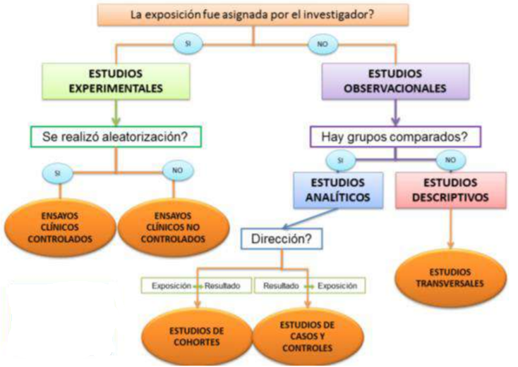

```{r setup, include=FALSE}
knitr::opts_chunk$set(echo = TRUE)
```

## INTRODUCCIÓN

Los estudios epidemiológicos clásicamente se dividen en Experimentales y No experimentales. En los estudios experimentales hay asignación de una exposición determinada osea que el investigador "impone" el factor al sujeto de investigación. Cuando el experimento no es posible se diseñan estudios no experimentales que simulan de alguna forma el experimento que no se ha podido realizar.



## ESTUDIOS TRANSVERSALES

Se consideran transversales los estudios en los que los datos de cada sujeto representan esencialmente un momento del tiempo. Estos datos pueden corresponder a la presencia, ausencia o diferentes grados de una característica o enfermedad (como ocurre, por ejemplo, en los estudios de prevalencia de un problema de salud en una comunidad determinada),
o bien examinar la relación entre diferentes variables en una población definida en un momento de tiempo determinado. 

Dado que las variables se han medido de forma simultánea, no
puede establecerse la existencia de una secuencia temporal entre ellas y, por tanto, estos diseños no permiten abordar el estudio de una presunta relación causa-efecto. Así pues, los estudios transversales
son por definición descriptivos.

## APLICACIÓN EN R

**Instalando paquetes**

```{r,echo=TRUE}
#install.packages("Nombre del paquete que se desea utilizar")
```

**Abriendo paquetes**
```{r,echo=TRUE}
#library("Nombre el paquete que se desea utilizar")
```


## EJEMPLO

```{r}
#install.packages("tidyverse")
library(tidyverse)
```

## IMPORTANDO LA BASE DE DATOS

Consideraciones:

* Tener la base de datos en una carpeta.

* Conocer el formato de la base de datos.

* .xls

**Instalando paquete readxl**

Ahora, necesitamos instalar el paquete readxl para importar datos de Excel. Éste es, en mi opinión, el paquete más sencillo de usar para importar este tipo de datos.

Instalamos el paquete con el siguiente código:

```{r}
#install.packages("readxl")
library(readxl)
```

Por otra parte, necesitamos conocer la ruta del archivo de Excel. La ruta, o path en inglés, es la dirección/ubicación donde está el archivo en tu computadora u ordenador.

**Ruta del archivo para importar de R a excel**

Primero, veremos cómo sacar esta ruta con una función muy chévere de R (Es de esos secretos que revelamos aquí para ser mejores con R).

Así, la función se llama file.choose(). Luego, esta función te permite abrir una ventana de Windows para buscar un archivo y regresa una variable tipo carácter con la ruta del archivo. Por ejemplo, en R.

```{r,echo=TRUE}
datos=file.choose()
```

Antes de cargar los datos a R, veamos cuales son las hojas que tiene este Excel. Luego, podemos utilizar el código

```{r,echo=TRUE}
excel_sheets(datos)
```

**Para leer los datos de excel hacia R**

```{r}
data1=read_excel(datos)
```

**Para leer los encabezados de la data**

```{r}
head(data1)
```

**Para ver el nombre de las variables que tiene mi data**
```{r}
names(data1)
```

**Para ver que tipo de variable tiene mi data**
```{r}
str(data1)
```

## ANÁLISIS DESCRIPTIVO

Variables cualitativas

* Frecuencia *table()*

* Proporciones  *prop.table()*

## EJEMPLO

```{r}
table(data1$GENERO)
```

```{r}
prop.table(table(data1$GENERO))*100
```

Si por ejemplo quisieramos hacer una tabla de contingencia ocupamos el siguiente comando

```{r}
table(data1$GENERO,data1$HTA)
```

Variable cuantitativa

* Un cuadro resumen *summary()*

* Medidas descriptivas como *mean()* y *sd()*

##EJEMPLO

```{r}
summary(data1)
```

```{r}
mean(data1$EDAD)
```

```{r}
sd(data1$EDAD)
```

Para facilitarnos todo este trabajo ocuparemos el comando **tableone()**

## ¿Qué es tableone?

El paquete tableone es un paquete R que facilita la construcción de la “Tabla 1”, es decir , la tabla de características iniciales del paciente que se encuentra comúnmente en los artículos de investigación biomédica. 

Los paquetes pueden resumir variables continuas y categóricas mezcladas en una tabla. Las variables categóricas se pueden resumir como recuentos y / o porcentajes. Las variables continuas se pueden resumir de forma “normal” (medias y desviaciones estándar) o “no normal” (medianas y rangos intercuartílicos).


```{r}
#install.packages("tableone")
library(tableone)
```

## Resumen de un solo grupo

**Caso de uso más simple**

El caso de uso más simple es resumir todo el conjunto de datos. Puede simplemente alimentar en el marco de datos a la función  principal **CreateTableOne()**. Puede ver que hay 210 pacientes en el conjunto de datos.

```{r}
tab=CreateTableOne(data = data1)
tab
```

Como observamos en la tabla **tab** no muestra todos los niveles de las variables categóricas por lo tanto debemos de ocupar un comando que nos muestre todos esos niveles, el comando a utilizar es **print()**

```{r}
print(tab,showAllLevels=T)
```

Si necesita información más detallada, incluido el número / proporción que falta. Utilice el método **summary()** en el objeto de resultado. Las variables continuas se muestran primero y las variables categóricas se muestran en segundo lugar.


```{r}
summary(tab)
```

Ahora bien, si lo que deseamos es comparar todo este conjunto de datos con una variable dependiente, utilizamos el comando **strata**

```{r}
tab1=CreateTableOne(data = data1,strata = "HTA")
tab1
```

```{r}
print(tab1,showAllLevels=T,quote = TRUE,formatOptions = list(big.mark = ","))
```

Es posible que desee ver solo las variables categóricas o continuas. Puede hacer esto accediendo a la parte **CatTable** y la parte **ContTable** del objeto TableOne de la siguiente manera. Los métodos summary () se definen para ambos, así como el método print () con varios argumento

```{r}
#Solamente la parte categórica
print(tab1$CatTable)
```

```{r}
#Solamente la parte continua
print(tab1$ContTable)
```


