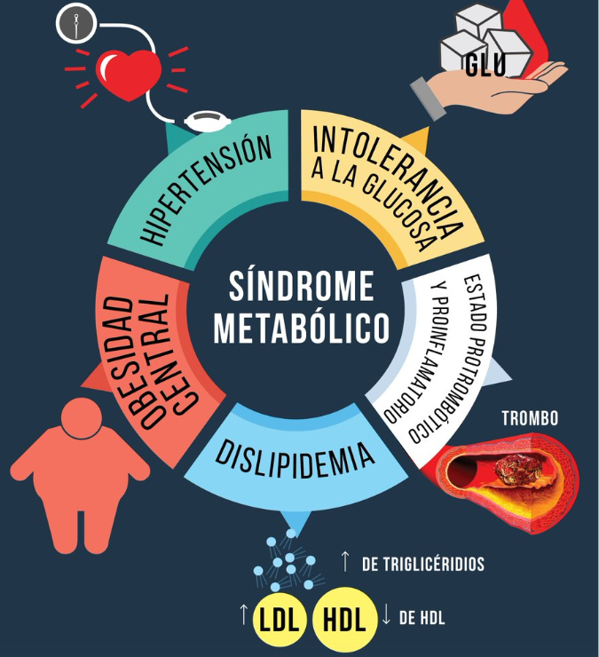

# cross-sectional-studies

La enfermedad cardiovascular es un problema mundial de salud pública. Se han identificado los llamados factores de riesgo cardiovascular (FRCV), así como los componentes del denominado «síndrome metabólico» (SMet). La importancia de su tamizaje en la población adulta es su capacidad de ser modificables mediante intervenciones sanitarias. El objetivo del presente estudio es el de cuantificar la prevalencia de los FRCV, del síndrome metabólico y la hiperuricemia en el personal de la Facultad de Medicina.

Para ello utilizaremos, la paqueteria tableone de R que facilita la construcción de la "Tabla 1", es decir , la tabla de características de referencia del paciente que se encuentra comúnmente en los trabajos de investigación biomédica. 

Los paquetes pueden resumir variables continuas y categóricas combinadas dentro de una tabla. Las variables categóricas se pueden resumir como recuentos y/o porcentajes. Las variables continuas se pueden resumir de forma “normal” (medias y desviaciones estándar) o “no normal” (medianas y rangos intercuartílicos).

